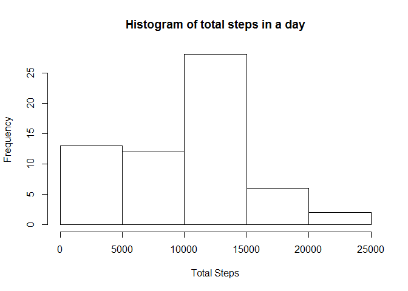
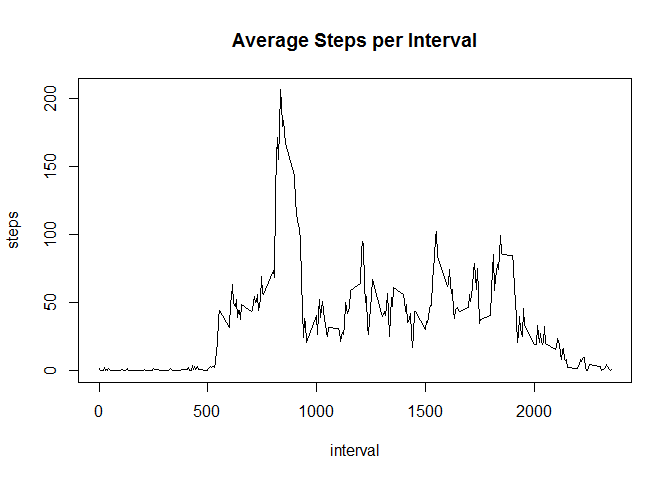
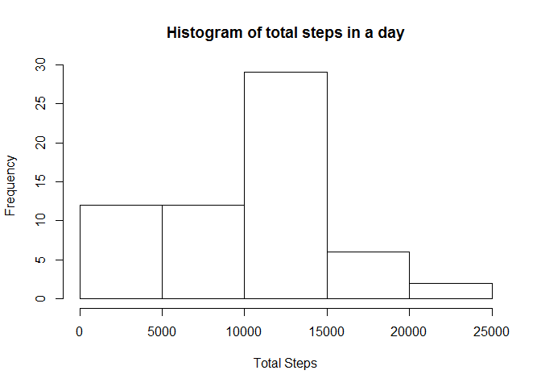
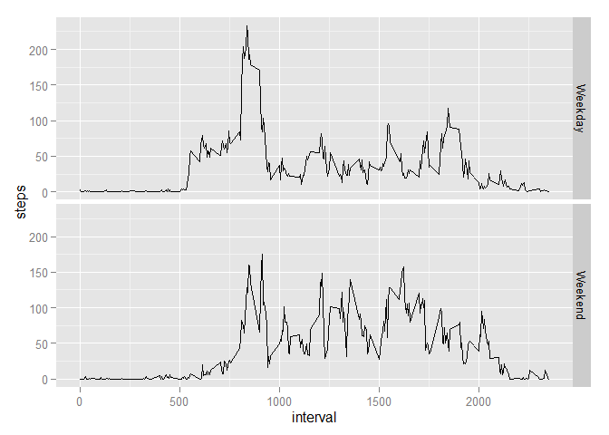

# Reproducible Research: Peer Assessment 1


## Loading and preprocessing the data  


```r
rawdata <- read.csv("activity.csv", stringsAsFactors = FALSE, na.strings="NA")
rawdata$date <- as.POSIXct(rawdata$date)
```

## What is mean total number of steps taken per day?  


```r
totalbyday <- tapply(rawdata$steps, rawdata$date, sum, na.rm = TRUE)
hist(totalbyday,main="Histogram of total steps in a day",xlab="Total Steps")
```

 

Mean and Median steps per day are:


```r
mean(totalbyday, na.rm = TRUE)
```

```
## [1] 9354.23
```

```r
median(totalbyday, na.rm = TRUE)
```

```
## [1] 10395
```

## What is the average daily activity pattern?  

```r
averagebyinterval <- aggregate(steps ~ interval, FUN=mean, data=rawdata)
plot(averagebyinterval, type="l", main ="Average Steps per Interval")
```

 
What 5 minute interval has the maximum average number of steps


```r
averagebyinterval$steps[averagebyinterval$steps== max(averagebyinterval$steps, na.rm=TRUE)]
```

```
## [1] 206.1698
```

## Imputing missing values

Total Missing Values


```r
sum(is.na(rawdata$steps))
```

```
## [1] 2304
```

Replace values with the mean for that interval


```r
meanfixdata <- transform(rawdata, steps=ifelse(is.na(steps), averagebyinterval$steps[averagebyinterval$interval == interval], steps ))
```

New histogram, mean and averages

```r
totalbydayfixed <- tapply(meanfixdata$steps, meanfixdata$date, sum, na.rm = TRUE)
hist(totalbydayfixed,main="Histogram of total steps in a day",xlab="Total Steps")
```

 

```r
mean(totalbydayfixed, na.rm = TRUE)
```

```
## [1] 9530.724
```

```r
median(totalbydayfixed, na.rm = TRUE)
```

```
## [1] 10439
```

As you can see the missing values lowered the average and median steps per day slightly

## Are there differences in activity patterns between weekdays and weekends?


```r
meanfixdata$day <- weekdays(meanfixdata$date)
meanfixdata$wday <- as.factor(ifelse(meanfixdata$day == "Saturday" | meanfixdata$day == "Sunday", "Weekend", "Weekday"))
library(ggplot2)
averagebyintervalfixed <- aggregate(steps ~ interval + wday, FUN=mean, data=meanfixdata)
qplot(interval,steps, data=averagebyintervalfixed, facets = wday ~ . ,geom ="line")
```

 
